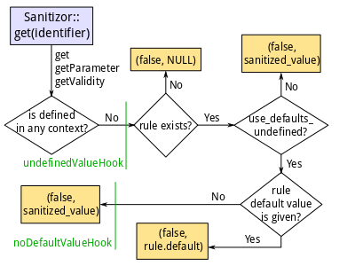

unfuck.php
==========

:project:       unfuck.php
:author:        meisterluk
:date:          since 2011, updates {12.09.10, 12.02.19}
:version:       beta
:license:       Emailware
:version:       1.0

Whenever you have to yell “Fuck off, PHP!” this set of snippets will help you to unfuck PHP.
It supports you in avoiding bullshitty php code. Grab any code you like.

Goals
-----

`I dislike PHP`_. But I have some legacy code I have to deal with. Therefore I wrote some snippets I can easily copy and paste to my source code and make PHP better. The ``unfuck.php`` file focuses on the following things:

* Enforce basic Unicode support.
* Provide missing stdlib functions and classes.
* Dealing with php's buggy type system.
* Provide a good sanitization mechanism.

Future ideas
------------

* ltrim and rtrim might be a good idea
* If identifier is defined in various contexts, take the value which matches the supplied rule.

Properties
----------

* Requires PHP version ≥ 5.
* The ``unfuck.tests.php`` file provides an exhaustive set of unittests.
* The implementation works with ``error_reporting(E_ALL | E_STRICT)``; the most restrictive error reporting.
* The implementation does not focus on performance, but stability and the principle of least astonishment.
* Even though components depend on each other [0]_, the idea is to extract any source code you want to use.

.. [0] For example, the ``Notifications`` class uses the ``Stack`` class. The ``Sanitizor`` uses the ``isEmpty`` function.

Tutorial
--------

Have you ever thought about brainfucks like this?
::

    php > $a = '0'; var_dump(empty($a));
    true
    php > $a = '00'; var_dump(empty($a));
    false

``unfuck.php`` provides an ``isEmpty`` function which is an type safe alternative.
Furthermore ``isEmpty`` is a function does allow constants as parameter::

    php > var_dump(empty(''));
    PHP Parse error:  syntax error, unexpected T_CONSTANT_ENCAPSED_STRING in Command line code on line 1
    php > var_dump(isEmpty(""));
    bool(true)
    php > var_dump(isEmpty("0"));
    bool(false)

Other useful functions are the ``blacklist`` and ``whitelist`` functions::

    php > $settings = array("pwd" => "lock4351", "user" => "foobar", "debug" => true);
    php > var_dump(whitelist($settings, array("pwd", "user")));
    array(2) {
      ["pwd"]=>
      string(8) "lock4351"
      ["user"]=>
      string(6) "foobar"
    }

For any further documentation or other example refer to the inline documentation or the testsuite.

Stack
~~~~~

A stack_ is data structure which is known for its operations ``push`` and ``pop`` which works with elements in a LIFO principle::

    php > $stack = new Stack();
    php > $stack->push(4);
    php > $stack->push(2);
    php > foreach ($stack->iterate() as $value) { echo $value; }
    42
    php > $stack->pop();
    2
    php > $stack->count();
    1

The constructor of the ``Stack`` class takes two optional arguments: A ``max_size`` and ``order``.
The maximum size allows to specify a maximum size for the stack::

    php > $stack = new Stack(1);
    php > $stack->push(4);
    php > $stack->push(2);'
    PHP Fatal error:  Uncaught exception 'OverflowException' with message ' [size 2 > 1] Failed to push value'

You might be wondering why iteration over a stack (LIFO principle) returns the elements in order of pushing.
This is due to the compatibility of the stack to an array. The ``Stack`` class provides almost operations on stacks which are available for arrays in the standard library. This includes count, pad, reverse, sort and unique. Using those functions you can access several elements of the stack at the same time; a behavior typically not available for stacks.
However, ``unfuck.php`` provides a mechanism to achieve real stack feeling: The ``order`` parameter::

    php > $stack = new Stack(Stack::INFINITE_SIZE, Stack::ORDER_STACK);
    php > $stack->push(4);
    php > $stack->push(2);
    php > foreach ($stack->iterate() as $value) { echo $value; }
    24
    php > var_dump($stack->pop());
    int(2)
    php > var_dump($stack->count());
    int(1)
    php > var_dump($stack->slice(0, 2)));
    array(2) {
      [0]=>
      int(2)
      [1]=>
      int(4)
    }

The default parameter of ``order`` is set to ``ORDER_LIST``::

    php > $stack = new Stack();
    php > $stack->push(4);
    php > $stack->push(2);
    php > var_dump($stack->slice(0, 2));
    array(2) {
      [0]=>
      int(4)
      [1]=>
      int(2)
    }

It's even more stack-like if elements are popping off the stack during the iteration::

    php > $stack = new Stack(Stack::INFINITE_SIZE, Stack::ORDER_STACK);
    php > $stack->push(4);
    php > $stack->push(2);
    php > foreach ($stack->iteratePopping() as $value) { echo $value; }
    24
    php > $stack->count();
    0

Sanitizor
~~~~~~~~~

The ``Sanitizor`` class provides a beautiful implementation for sanitizing parameters.
It's the main reason for me to develop and use ``unfuck.php``. It serves as an abstraction of PHP5's `filter module`_.
The main idea to specify **contexts** as data sources (they default to the superglobals) and add **rules** to specify the desired layout/type of the parameter in the source. If you need some kind of post processing for the value (eg. strtoupper) you can apply **filters**. **Hooks** are also available and described below.
Let's take an example::

    php > $sani = new Sanitizor();
    php > $sani->clearContexts();
    php > $sani->addContext(array('page' => 'Main'));
    php > var_dump($sani->getParameter('page'));
    Main

I guess you will use the Sanitizor in a webserver environment later on and therefore the superglobals (``$_GET``, ``$_POST``, etc) are loaded automatically. For demonstration purposes we don't want this and therefore ``clearContexts()`` is called which removes all defined contexts.
We add another context (which is always a associative array) and request the parameter *page*. Because *page* is defined in some context and no further contexts and filters are specified, it will be returned immediately.
Now we define our first *rule*::

    php > $sani = new Sanitizor();
    php > $sani->clearContexts();
    php > $sani->addContext(array('page' => 'Main'));
    php > $sani->addRule('page', Sanitizor::TYPE_STRING, 'Hello World');
    php > var_dump($sani->getParameter('page'));
    string(4) "Main"
    php > $sani->removeRule('page');
    php > $sani->addRule('page', Sanitizor::TYPE_INTEGER, 42);
    php > var_dump($sani->getParameter('page'));
    int(42)
    php > var_dump($sani->getValidity('page'));
    bool(false)
    php > var_dump($sani->get('page'));
    array(2) {
      [0]=>
      bool(false)
      [1]=>
      int(42)
    }

First of all we have the same definition like in the previous example, but provide a rule for the parameter *page*. It requires the parameter to be a string and defines the default value ``'Hello World'`` it the type is not matched. Here *page* is a string and therefore returned directly.
Now we want to investigate the behavior if the type does not match. We remove the previous rule and provide a new one. Now *page* has to be an integer and our default value is 42. As far as *page* found in the context is not an integer [1]_, the default value will be used.
You can determine whether or not the parameter is a “valid” value (meaning it was found in some context) by the ``getValidity($identifier)`` method. You can also use ``get($identifier)`` to retrieve an array with the elements validity and parameter.

I would also like to show you an example for applying a filter::

    php > $sani = new Sanitizor();
    php > $sani->clearContexts();
    php > $sani->addContext(array('page' => 'Main'));
    php > $sani->addRule('page', Sanitizor::TYPE_STRING, 'Hello World');
    php > var_dump($sani->getParameter('page'));
    string(4) "Main"
    php > $sani->addFilter('page', array('lower'));
    php > var_dump($sani->getParameter('page'));
    string(4) "main"

You can register custom filters as well::

    php > $sani = new Sanitizor();
    php > $sani->clearContexts();
    php > $sani->addContext(array('page' => 'Main'));
    php > $sani->addRule('page', Sanitizor::TYPE_STRING, 'Hello World');
    php > function custom_filter($value, $parameters=NULL) { return array(true, $value.'42'); }
    php > $sani->registerFilter('custom', 'custom_filter'); // (name, callback)
    php > $sani->addFilter('page', array('custom'));
    php > var_dump($sani->get('page'));
    array(2) {
      [0]=>
      bool(true)
      [1]=>
      string(6) "Main42"
    }

If the default value is not provided and/or the parameter is not given in any context, the triggered behavior is difficult to explain. For example it depends on the configuration variables ``use_defaults_invalid`` and ``use_defaults_undefined``. We need a flow chart for this:

This means the returned parameter is one of the following values:

* context[identifier]
* context[identifier] after applying a filter
* the default value of a rule
* the default value for this type defined by the rule
* NULL

.. [1] Please also recognize that the Sanitizor does not look for some integer *page* in various contexts but uses the first *page* value that can be found.

Sanitizor's Hooks
~~~~~~~~~~~~~~~~~

Hooks make it possible to modify data if certain conditions are met.
As an example they provide a powerful mechanism to modify the result for a certain ``identifier``.

They are called during the evaluation and can be overwritten by inheritance of the ``Sanitizor`` class.
See the flow chart above to find out when a certain hook will be triggered and check out the test suite to find out how to use them.

Installation
------------

* Install the user.ini according to the `PHP Manual`_.
* Copy&Paste or ``include`` source code of ``unfuck.php``.
* Watch out for ``@config`` directives in ``unfuck.php`` where you should adjust configuration variables to your own needs.

Please stop using PHP.
Every time you write php code little kittens die.

greets,
meisterluk

.. _`I dislike PHP`: http://lukas-prokop.at/proj/documents/php_rant/
.. _`PHP Manual`: http://www.php.net/manual/en/configuration.file.per-user.php
.. _`filter module`: http://www.php.net/manual/en/book.filter.php
.. _stack: http://en.wikipedia.org/wiki/Stack_%28abstract_data_type%29
